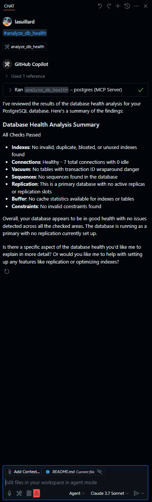
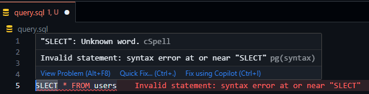
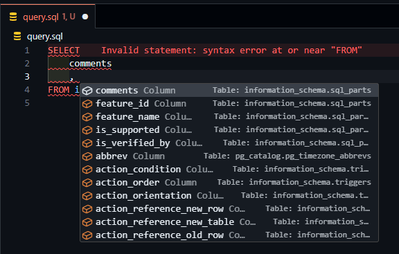

# postgres-examples

Personal study elements and examples for PostgreSQL.

## ✨ Examples

Following examples are available:

### 🤖 Postgres MCP (VS Code)

[Postgres MCP Pro](https://github.com/crystaldba/postgres-mcp) (Model Context Protocol) setup for VS Code.

### 🔤 Postgres LSP (VS Code)

[Postgres LSP](https://github.com/supabase-community/postgres-language-server) (Language Server Protocol) setup for VS Code with Dev Container.

SQL linting:

Code completion (Postgres server should be running):

### ☁️ aws-s3-extension

Example using [aws-s3-extension](https://github.com/chimpler/postgres-aws-s3) to dump and restore data to / from S3. See [aws-s3-extension](./aws-s3-extension) directory for more details.
